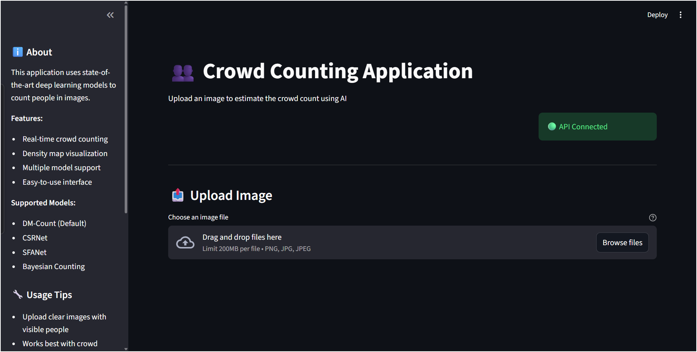
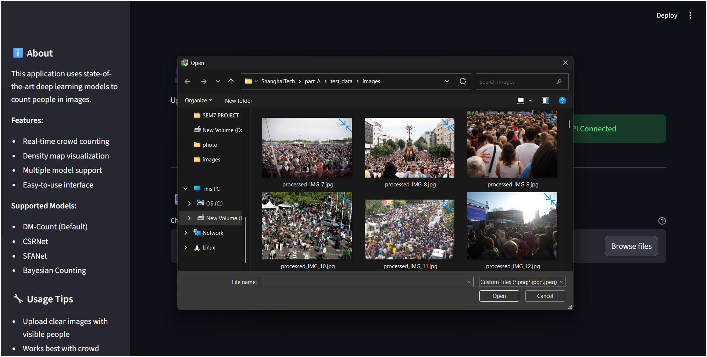
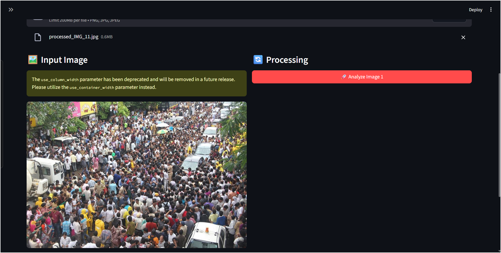
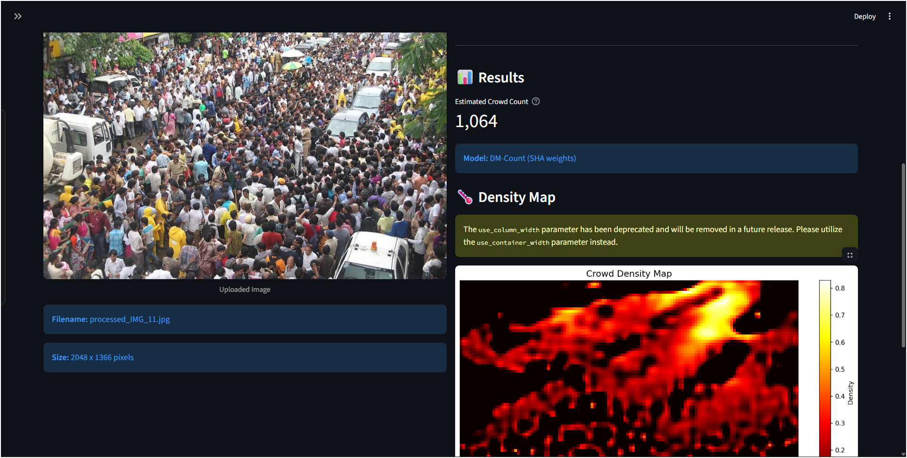
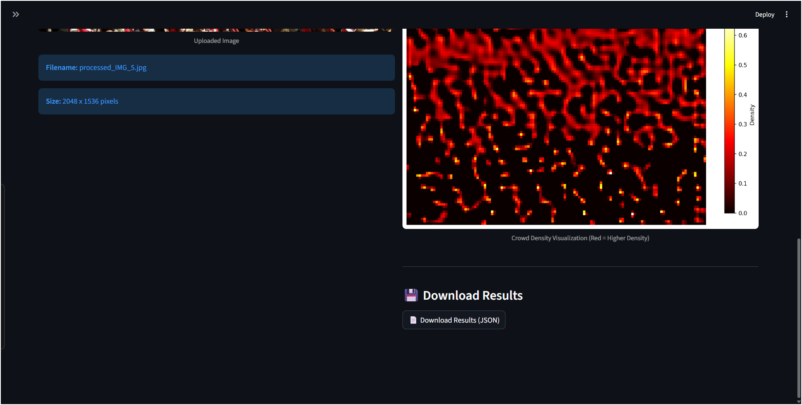

# Crowd Counting & Density Mapping System

A modern system to automatically estimate crowd size and visualize crowd density from images using deep learning.

---

## Table of Contents

- [Overview](#overview)
- [Features](#features)
- [System Architecture](#system-architecture)
- [Use Cases](#use-cases)
- [Crowd Management Effectiveness](#crowd-management-effectiveness)
- [Setup & Installation](#setup--installation)
- [How To Use (Step-by-Step)](#how-to-use-step-by-step)
- [Example Screenshots](#example-screenshots)
- [API Reference](#api-reference)
- [Troubleshooting & Tips](#troubleshooting--tips)
- [License & Attribution](#license--attribution)

---

## Overview

This system leverages state-of-the-art deep learning models to estimate the number of people (or crows/objects) in an image, and generates a density map highlighting crowded regions. It consists of a backend API (FastAPI, LWCC) and a minimalist Streamlit frontend for end-user interaction.

---

## Features

- **Accurate crowd estimation** using pre-trained deep learning models.
- **Density map visualization** for insight into *where* the crowd is densest.
- **Single and batch image processing**.
- **Simple web-based interface**—no data science expertise required.
- **Exportable results and easy integration** with other crowd management dashboards.

---

## System Architecture

- **Backend:** FastAPI, Python, [LWCC](https://github.com/tersekmatija/lwcc) (Lightweight Crowd Counting library)
- **Frontend:** Streamlit (minimal design)

## Use Cases

- **Event Crowd Management:** Monitor attendance at concerts, rallies, or sports events.
- **Public Safety:** Estimate density in real time for safety compliance in public places.
- **Urban Planning:** Analyze crowd behavior in transport hubs or city squares.
- **Wildlife Monitoring:** Adapt the same technique for animal group estimation in conservation work.

---

## Crowd Management Effectiveness

- **Real-time Estimation:** Enables proactive responses to overcrowding.
- **Hotspot Detection:** Density map visualization helps in *redirecting flows* and *placing signage/staff*.
- **Automated Reporting:** No need for labor-intensive manual counting.
- **Data-Driven Decisions:** Historical analysis for future planning (e.g., optimum event layout).

---

## Setup & Installation

### Requirements

- Python 3.9+
- pip (Python package manager)
- Internet connection (models download automatically if missing)

### Step-by-Step

1. **Clone the repository** and enter the directory:
git clone <your-repo-url>
cd crowd-counting-system
2. **Install dependencies:**
pip install -r requirements.txt
3. **Start the backend FastAPI server:**
python app.py
4. **Start the Streamlit frontend (in a different terminal):**
streamlit run streamlit_app.py

---

## How To Use (Step-by-Step)

### 1. Open the Web Interface

- Visit `http://localhost:8501` in your browser.

> _Insert screenshot of Streamlit home page here_
>
> 

### 2. Upload Image(s)

- Click "Browse files" and select one or more crowd images.

> _Insert screenshot of upload section here_
>
> 
  
### 3. Analyze

- Click “Analyze Image(s)” to start the estimation.

> _Insert screenshot of processing/analysis here_
>
> 

### 4. View Results

- See the **input image**, **estimated count**, and **density map**.
- Download the results for documentation or reporting.

> _Insert screenshot of output/results here_
>
> 

---

## Example Screenshots

Paste actual screenshots from your usage for clarity.

- System home page
- File upload section
- Analysis in progress
- Results and download option

---

## API Reference

### `/predict` (POST)
- **Input:** Single image file
- **Output:** Estimated count, density map (as base64 image), model details

### `/predict-batch` (POST)
- **Input:** Multiple image files
- **Output:** List of estimated counts (one per image)

### `/health` (GET)
- **Output:** Server and model status

### `/models` (GET)
- **Output:** Available crowd counting models

---

## Troubleshooting & Tips

- **First run may take longer** (model weights are downloaded automatically).
- **If you get a 503 error**, check that the `.lwcc/weights` directory is created and writable.
- **Results are best** for overhead/crowd-facing images with good resolution.
- For large files or batch jobs, allow extra processing time.
- Upgrade pip if you encounter dependency issues:  
`pip install --upgrade pip`

---

## License & Attribution

- Deep learning models and code use Open Source ([MIT/Apache/GPL as per your setup]).
- Powered by [LWCC](https://github.com/tersekmatija/lwcc) and Streamlit.

---

**_Paste actual screenshots in the referenced places for the best user experience. For questions, open an issue on your project repository._**
